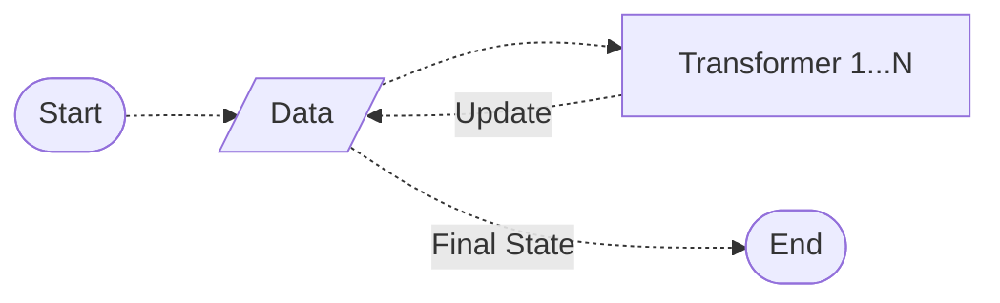

# Simple Pipe Function for Call-Chaining

This package provides a single `pipe` function focused on:

- Simplicity of use
- Enabling method call chaining on scalar data types
- No special wrapper objects
- No predefined functions that limit flexibility

## Introducing the `pipe` Function

In PHP, scalars and arrays aren't objects, and functions handle them exist in the global namespace, making method chaining difficult.

The `pipe` function provided in this package allows step-by-step data transformation in a chaining way.



Let's look at a simple example of method chaining in JavaScript:

```javascript
const x = "  ,  1 ,  3,   2  ,   "
    .split(",")
    .map(str => str.trim())
    .filter(word => word)
    .map(word => parseInt(word))
    .map(num => num * 2)
    .join(", ");
// x == "2, 6, 4"
```

Here’s the PHP version using the `pipe` function:

```php
$x = pipe("  ,  1 ,  3,   2  ,   ",
    fn($s) => explode(",", $s),
    fn($a) => array_map('trim', $a),
    fn($a) => array_filter($a),
    fn($a) => array_map('intval', $a),
    fn($a) => array_map(fn($n) => $n * 2, $a),
    fn($a) => join(", ", $a)
); // $x == "2, 6, 4"
```

While slightly more verbose, we can see the data is transformed in the chaining manner.

<details>
  <summary>The same PHP implementation without pipe</summary>

```php
$x = "  ,  1 ,  3,   2  ,   ";
$a = explode(",", $x);
$a = array_map('trim', $a);
$a = array_filter($a);
$a = array_map('intval', $a);
$a = array_map(fn($n) => $n * 2, $a);
$x = join(", ", $a);
```

</details>

## Installation

Use [Composer](https://getcomposer.org) to install this package.
This package requires PHP 8.0 or later.

```shell
composer require selfiens/pipe
```

After installing the package, load the `autoload.php` file.

## Global `pipe` Function

You can have the `pipe` function in the root namespace.

### Method 1: call `\Selfiens\Pipe\Pipe::install()`

```php
// Installs the "pipe" function in the global namespace
\Selfiens\Pipe\Pipe::install();
```

### Method 2: load it automatically via composer.

Add `"vendor/selfiens/pipe/src/pipe_global.php"` in the `autoload/files` section of your `composer.json`:

```json
{
  "autoload": {
    "files": [
      "vendor/selfiens/pipe/src/pipe_global.php"
    ]
  }
}
```

You may need to run the following if you have created autoload cache.

```shell
composer dump
```

### Non-global `Pipe::pipe` Method

To avoid global namespace conflicts, use the namespaced `Pipe::pipe` method, especially in larger projects or with multiple third-party packages.

```php
use Selfiens\Pipe\Pipe;

Pipe::pipe(...);
```

### Function Signature

For brevity, the rest of this document will use the global `\pipe` function.

```php
pipe(mixed $data, callable ...$transformers): mixed
```

The first parameter specifies the data to be transformed, while the remaining parameters are callable transformer functions.

## Basic Examples

Calling `pipe` without transformer functions returns the input data unchanged.

```php
pipe('x'); // = 'x'
```

You can add transformer functions following the data parameter.

```php
pipe('x', 
    fn($s) => $s . 'y',
    fn($s) => $s . 'z',
    fn($s) => $s . '0',
    ...
); // = 'xyz0...'
```

You can use other callable forms.

```php
pipe('  x  ',
    'trim', // global function
    fn($s) => $s . 'y'
    function($s) { return $s . 'z'; },
    MyClass::myStaticMethod(...),
    [MyClass::class, 'myStaticMethod'],
    [$myObject, 'myMethod'],
);
```

The following is a valid PHP code.

```php
$starizedPhoneNumber = pipe(
    $phoneNumber,
    PhoneNumberFormat::numbersOnly(...),
    PhoneNumberFormat::starize(...),
    PhoneNumberFormat::dashify(...),
);
```

## Tests

```shell
composer test
```